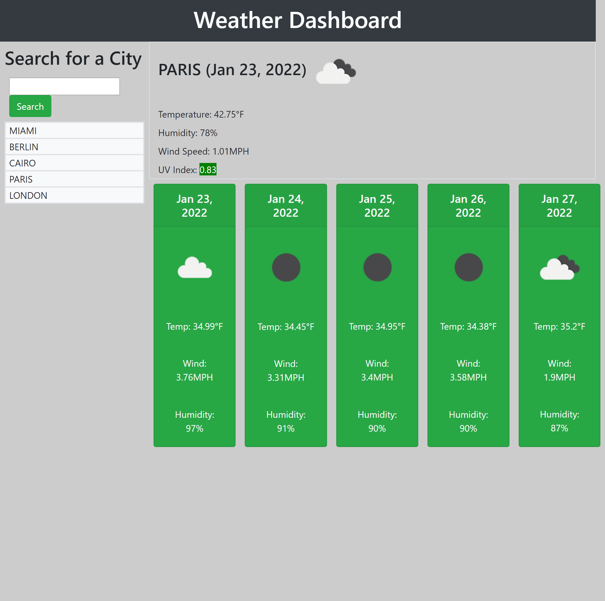

# Weather-Dashboard

This application shows live weather and 5 day forecast for cities around the world. Also, it saves previous searched cities just in case you want to check them out again.

## Instruction

You should type city name in search section and you can find current date, weather condition, temperature, humidity, wind speed and UV index. Also, you can find 5 day forecast for the same place with the same information.
Your searched city will be saved in local storage and you can check weather again by clicking on it.

## External liberaries and API used :

- OpenWeather API
- Moment.js
- Bootstrap

Here is the screenshot of the page:

You can access to web page by following link:

https://sasansinson.github.io/weather-dashboard/

